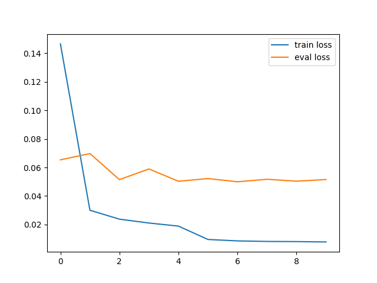
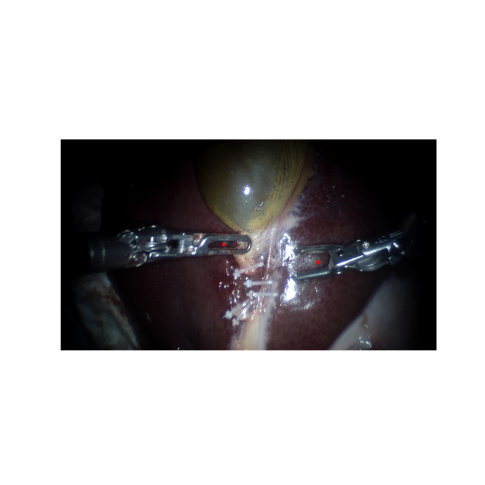

# coordinate_prediction

## data preparation

```bash
python utils.py --root_img /path/to/images/dir ----root_ann /path/to/annotatations/dir
```

## train model

1. set variables in scripts
2. 
```bash
bash train.sh
```

## visualization

```bash
bash predict.sh
```